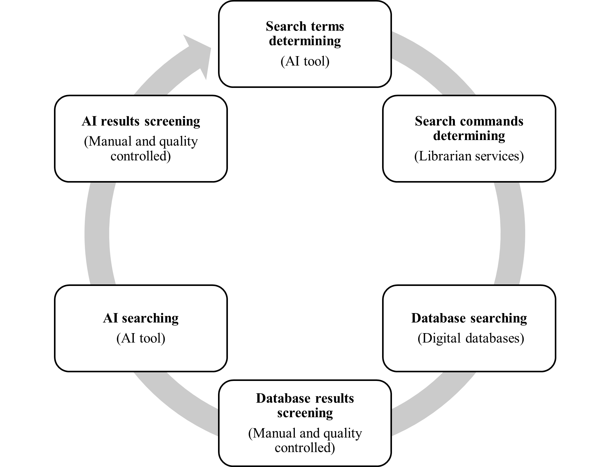

# Paper title: The Price Premium of Residential Energy Performance Certificates: A Scoping Review of the European Literature

This repository deposits all the search commands, data, and code used for our research paper to allow for reproducibility.

## Authors
Yunbei Ou, Nick Bailey, David Philip McArthur, Qunshan Zhao

## Citation
Yunbei Ou, Nick Bailey, David Philip McArthur, Qunshan Zhao,
The price premium of residential energy performance certificates: A scoping review of the European literature,
Energy and Buildings,
2025,
115377,
ISSN 0378-7788,
https://doi.org/10.1016/j.enbuild.2025.115377.
(https://www.sciencedirect.com/science/article/pii/S0378778825001070)

## Usage
> - Download/clone repo locally
> - Run the 'data_analysis.ipynb' in the original file structure

## Data
Data folder contains all the files and data generated in the searching and screening process. The subfolders/files are in order, showing a sequential, transparant process.

The whole searching and screening process:

The data extraction results (at both literature and model level) are available in .csv/.xlsx formats. 

## Figures
Figures folder contains all the figures generated by the code and included in the paper.

## Analysis notebook
The 'data_analysis.ipynb' shows Python code for data preprocessing, analysis, and visualisation on extracted data ('Data/03Data_extraction/literatures.csv' and 'Data/03Data_extraction/models.csv'), including all results in the research paper. 

## Acknowledgements
This work was made possible by the ESRC-funded Advanced Quantitative Methods (AQM) Doctoral Studentship [ES/P000681/1] and ESRC’s on-going support for the Urban Big Data Centre [ES/L011921/1 and ES/S007105/1]. Dr Qunshan Zhao has received the support from the Royal Society International Exchange Scheme [IEC\NSFC\223042].

